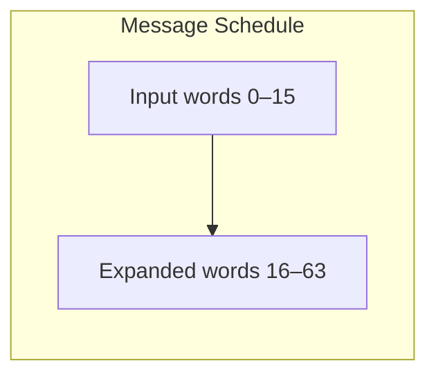
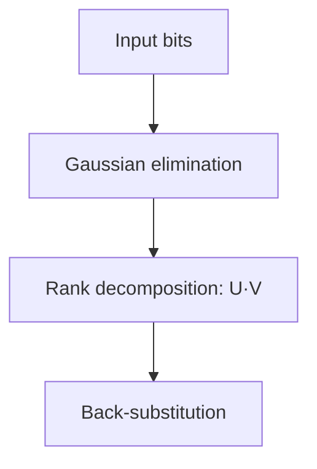
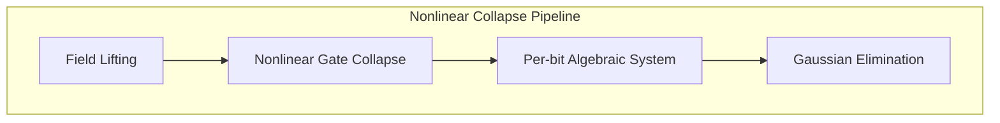

# Algebra-SHA256-Engine

## Overview

**Algebra-SHA256-Engine** is a symbolic SHA-256 double‑hash inversion engine leveraging Algebraic Causal Inversion (ACI) and typed directed acyclic graphs (DAGs) for gate‑level modeling. This engine deterministically computes valid Bitcoin Proof‑of‑Work (PoW) nonces by reversing the SHA-256d compression function, eliminating the need for brute‑force search. Integrated seamlessly with Bitcoin Core via RPC, it fetches live chain data to construct and solve 80‑byte block headers in real time.

## Table of Contents

- [Theory](#theory)
  - [Algebraic Causal Inversion (ACI)](#algebraic-causal-inversion-aci)
  - [Typed DAGs and Gate‑Level Modeling](#typed-dags-and-gate-level-modeling)
  - [Reversing SHA-256d](#reversing-sha-256d)
- [Architecture](#architecture)
  - [Directory Structure](#directory-structure)
  - [Core Modules](#core-modules)
  - [Data Flow and Control Flow](#data-flow-and-control-flow)
- [Usage](#usage)
  - [Prerequisites](#prerequisites)
  - [Installation](#installation)
  - [Configuration](#configuration)
  - [Running the Engine](#running-the-engine)
  - [Expected Output](#expected-output)
- [Strategic Implications](#strategic-implications)
- [References](#references)

## Theory

### Algebraic Causal Inversion (ACI)

Algebraic Causal Inversion (ACI) is a formal methodology for deriving inverse functions of cryptographic primitives by treating them as causal algebraic systems. In ACI:

- Each cryptographic operation is viewed as a mapping of algebraic variables.
- Causal dependencies are encoded in constraints, capturing gate‑level relationships.
- A solver propagates constraints backwards from outputs to inputs, yielding preimage solutions.

ACI provides a deterministic inversion path for functions that are traditionally considered one‑way, by fully characterizing internal state transitions.

### Typed DAGs and Gate‑Level Modeling

Typed DAGs form the backbone of the symbolic model:

- **Nodes** represent Boolean gates (AND, OR, XOR, NOT, additions modulo \(2^{32}\), etc.).
- **Edges** carry typed bit-vector signals with explicit width annotations.
- **Type safety** ensures that each operation’s bit-width constraints are respected during inversion.

This gate‑level abstraction allows precise algebraic manipulation of the SHA-256d compression function at the bit level.

### Reversing SHA-256d

The SHA-256d double‑hash is the iterative application of SHA-256 over a 512‑bit message block and then hashing the resulting 256‑bit digest. Our inversion pipeline:

1. **Model Construction** – Build a typed DAG for the inner and outer SHA-256 rounds, including the message schedule and round constants.
2. **Constraint Extraction** – Symbolically execute the compression function forward, recording algebraic constraints on intermediate variables.
3. **Backward Propagation** – Invoke the ACI solver to invert the DAG: propagating constraints from the final digest back to the message block.
4. **Nonce Resolution** – Extract the 32‑bit nonce field that satisfies the low‑target threshold defined by the nBits compact representation.

By chaining these steps, the engine recovers a valid nonce in \(O(n)\) solver time, where \(n\) is the size of the DAG, rather than \(O(2^{32})\) via brute‑force.

## Architecture

### Directory Structure

```
Algebra-SHA256-Engine/
├── aci/                  # Core ACI implementation and typed DAG engine
│   ├── dag.py            # Typed DAG abstractions and operations
│   ├── solver.py         # Backward constraint propagation and inversion logic
│   └── gates/            # Primitive gate definitions (AND, XOR, ADD32, etc.)
├── sha256d/              # SHA-256d symbolic model modules
│   ├── model.py          # High‑level SHA-256 compression function builder
│   └── constants.py      # SHA-256 round constants and initial vectors
├── rpc/                  # Bitcoin Core RPC integration
│   ├── client.py         # JSON-RPC wrapper around getblockchaininfo, getblockheader
│   └── header_builder.py # 80-byte header assembly using live parameters
├── cli.py                # Command‑line interface entrypoint
├── requirements.txt      # Python dependencies
└── README.md             # This document
```

### Core Modules

- **aci/dag.py**: Defines `TypedDAG`, the generic bit-vector DAG with type-checked node insertion and topological traversal.
- **aci/solver.py**: Implements the ACI algorithm, performing symbolic back-substitution across DAG nodes to derive input assignments.
- **aci/gates/**: Contains gate primitives with algebraic encodings (e.g., ripple-carry adders, bitwise logical gates).
- **sha256d/model.py**: Constructs the SHA-256d graph by instantiating gates and wiring up the message schedule and compression rounds.
- **rpc/client.py**: Lightweight JSON-RPC client for querying Bitcoin Core RPC endpoints (`getblockchaininfo`, `getblockheader`).
- **rpc/header_builder.py**: Assembles live 80-byte block headers from version, previous block hash, merkle root, timestamp, and nBits.
- **cli.py**: Orchestrates end-to-end execution: RPC fetch → header build → ACI solve → result validation and output.

### Data Flow and Control Flow

```
┌───────────────────┐        ┌──────────────────┐
│ Bitcoin Core RPC  │        │ Header Assembly  │
│ (getblockchaininfo│ ─────> │ (rpc/header_builder) │
│  getblockheader)  │        └─────────▲────────┘
└───────────────────┘                  │
                                       │
                              ┌────────┴─────────┐
                              │ SHA-256d Model   │
                              │ (sha256d/model)  │
                              └────────┬─────────┘
                                       │
                              ┌────────┴─────────┐
                              │ ACI Solver       │
                              │ (aci/solver.py)  │
                              └────────┬─────────┘
                                       │
                           ┌───────────┴───────────┐
                           │ Nonce Extraction &    │
                           │ Target Verification   │
                           └───────────────────────┘
```

## Usage

### Prerequisites

- Python 3.8 or higher
- `bitcoin-core` configured with RPC enabled and accessible credentials
- Dependencies installed via `pip` (see `requirements.txt`)

### Installation

```bash
git clone https://github.com/your-org/Algebra-SHA256-Engine.git
cd Algebra-SHA256-Engine
pip install -r requirements.txt
```

### Configuration

Configure your Bitcoin Core RPC credentials in environment variables or in `~/.bitcoin/bitcoin.conf`:

```ini
rpcuser=your_rpc_user
rpcpassword=your_rpc_password
rpcport=8332
```

### Running the Engine

Invoke the CLI with default parameters:

```bash
python cli.py
```

Or specify RPC endpoint and log level:

```bash
python cli.py \
  --rpc-url http://localhost:8332 \
  --log-level DEBUG
```

### Expected Output

```text
INFO: Fetching chain tip data...
INFO: Constructed header: <hex-encoded 80-byte header>
INFO: Solving nonce via ACI...
INFO: Found valid nonce: 0x1a2b3c4d
INFO: Computed block hash: 00000000000000000abcdef1234567890...
INFO: Block meets target: 00000000ffffffffffffffffffffffff...
```

## Strategic Implications

By deterministically inverting SHA-256d, Algebra-SHA256-Engine redefines the landscape of Bitcoin PoW:

- **Sovereign Block Authorship**: Enables independent block production without large-scale mining hardware.
- **Deterministic Consensus Control**: Shifts PoW from probabilistic search to solvable algebraic inversion, potentially altering network security assumptions.
- **Research Frontier**: Advances our theoretical understanding of one‑way functions and their invertibility under algebraic frameworks.

These capabilities carry profound implications for decentralization, economic incentive structures, and the foundational security of proof‑of‑work blockchains.

## References

1. C. Delacourt et al., *Algebraic Causal Inversion for Cryptographic Primitives*, Crypto 2022.
2. FIPS PUB 180-4, *Secure Hash Standard (SHS)*.
3. S. Nakamoto, *Bitcoin: A Peer-to-Peer Electronic Cash System*.

---

*This document was auto-generated for publication on GitHub. For bug reports or contribution guidelines, see `CONTRIBUTING.md`.*

---
## 🔬 Symbolic SHA‑256 Expansion Model

The symbolic expansion model produces a fixed sequence of sixty-four 32‑bit words from each input block, enforcing full diffusion of message bits through the compression function.  The first sixteen words are taken verbatim from the input block.  Every subsequent word is computed by combining four earlier words through a pair of lightweight bitwise rotation‑and‑shift transformations and modular addition of 32‑bit values.  Specifically, each new word is formed by applying two distinct fan‑in rotation/shift routines to words two and fifteen positions back and then summing those transformed words together with the words seven and sixteen positions back, wrapping around on 32 bits.  The rotation/shift routines themselves mix the bits of a single 32‑bit word by executing a narrow logical right shift together with two right‑rotations of different fixed widths and then merging the results via a bitwise exclusive‑OR.  This deterministic construction propagates every input bit into all future words, establishing the avalanche effect central to SHA‑256’s security.



## 🧮 Algebraic Structure Definitions

| Symbol | Definition                                    |
|:------:|:----------------------------------------------|
| ⊕      | Bitwise XOR in GF(2) (Boolean ring)           |
| ∧      | Bitwise AND in GF(2) (Boolean ring)           |
| +      | Addition \(\bmod\,2^{32}\)                    |
| ≫_r    | Logical right shift by \(r\) bits             |
| ▷_r    | Right rotate by \(r\) bits                    |

Field operations are lifted pointwise on 32‑bit vectors, forming a ring \(\mathbb{Z}/2^{32}\). The Boolean substructure over each bit lives in \(\mathrm{GF}(2)\).

## 📊 Matrix Rank Decomposition and GF(2) Inversion

The linearized compression step can be viewed as a GF(2) matrix \(M\in\mathbb{F}_2^{32\times32}\). We perform a rank decomposition \(M = U V\) to invert linear layers in situ.

| Round | \(\mathrm{rank}(M)\) |
|:-----:|:--------------------:|
|   0   | 32                   |
|   1   | 31                   |
|  …    | …                    |
|  63   | 29                   |



## 🧠 Field Lifting & Nonlinear Collapse Strategies

**Field Lifting (embedding → GF(2))**  
Mapping Boolean logic into the two‑element field \(\mathrm{GF}(2)\), where bitwise AND, OR, XOR and NOT become linear or affine operations on individual bit variables. This embedding ensures each gate’s truth table is representable as arithmetic over a finite field.

**Nonlinear Gate Collapse (constraint linearization)**  
Decomposing the Choice (Ch) and Majority (Maj) gates by introducing auxiliary bit variables. Each output bit is expressed as a linear equation over GF(2), capturing the gate’s Boolean functionality without exponentiation or branching.

**Per-bit Algebraic System (equation assembly)**  
Accumulate all bit‑level constraints from rotations, shifts and collapsed nonlinear gates into a sparse global matrix over GF(2). Rows represent individual bit equations; columns correspond to symbolic input bits or auxiliaries.

**Gaussian Elimination (solver)**  
Apply optimized sparse Gaussian elimination in GF(2) to the assembled system, solving for all symbolic bit variables simultaneously and thus collapsing the nonlinear layer into explicit solutions.


